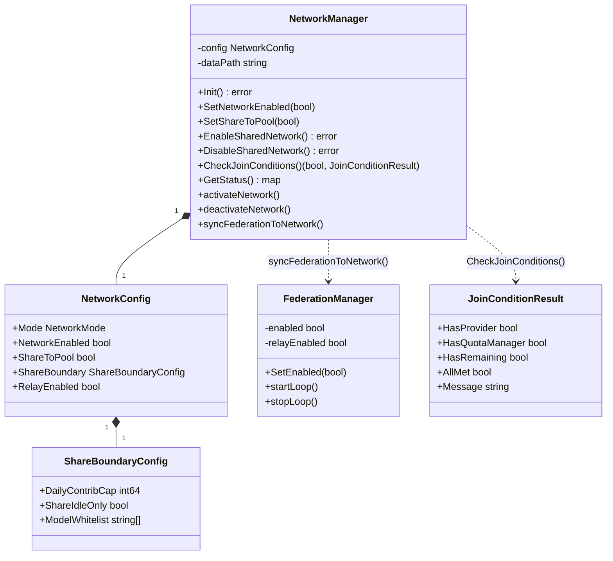
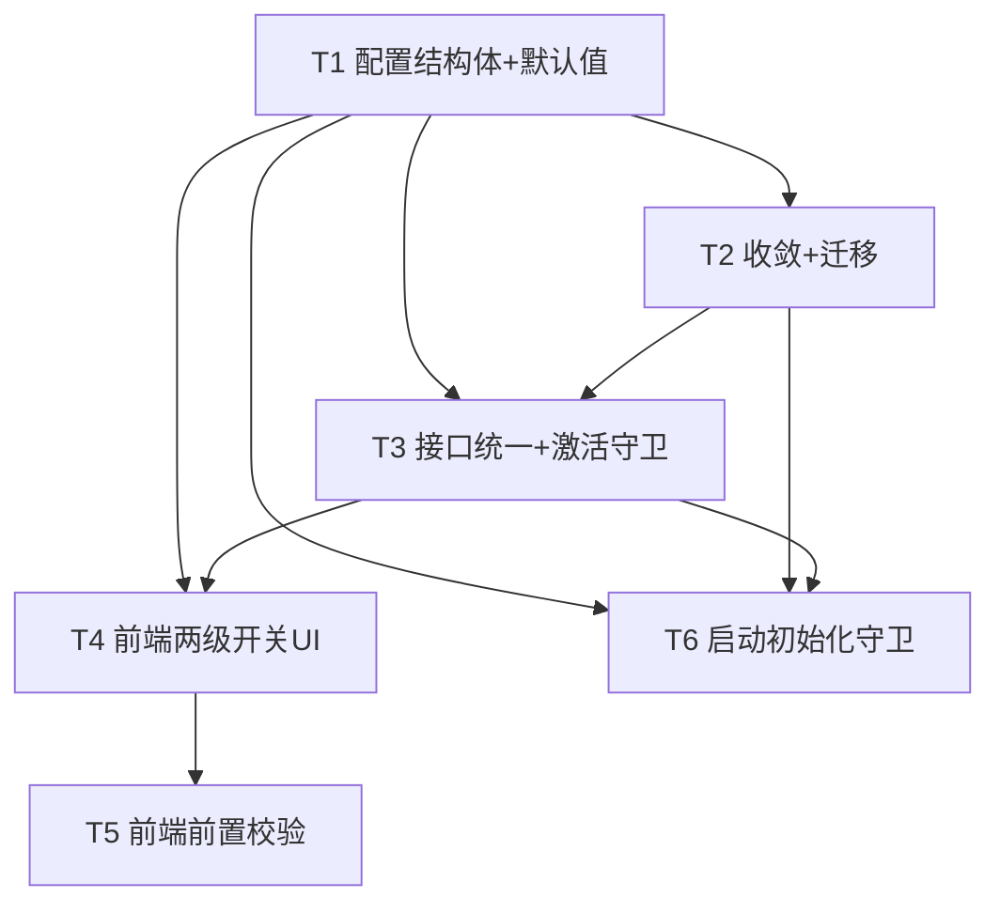

# OpenModelPool Phase 1 · 切片①「模式与两级开关底座」— 系统架构设计 + 任务分解

> **文档版本**: ARCH-Phase1-Slice1 v1.0
> **作者**: 高见远（架构师）
> **日期**: 2026-07-18
> **基于**: `docs/PRD-phase1.md`（§0/§3 REQ-1~4/§5 切片①）、`ROADMAP_v3.md`（第 3 节）、现有 `admin.html` / `admin-network.js` / `*.go` 真实代码
> **语言**: 简体中文
> **范围**: REQ-1、REQ-2、REQ-3、REQ-4、REQ-12（部分底座）

---

## 0. 代码现实核对（最重要的前提）

在开始设计前，对真实代码库做了逐一核查。**关键发现：后端已存在大量切片①所需的底座**，PRD 假设"需引入 network_enabled 配置"与代码现实不符。本设计按"已有底座上收口"推进，避免重写、降低回归风险。

| PRD 假设（切片①要做） | 代码现实（已存在） | 结论 |
|---|---|---|
| 后端引入 `network_enabled` 配置 | `network.go` `NetworkConfig.NetworkEnabled` 已存在，默认 `false`（`initNetworkManager` L324） | 已具备，仅收口 |
| `share_to_pool` 独立开关 | `NetworkConfig.ShareToPool` 已存在（L70），并有 `SetShareToPool`/`SetNetworkEnabled`（L829/L848） | 已具备 |
| 两级开关后端接口 | `POST /api/network/toggle`（server.go L247）、`EnableSharedNetwork`/`DisableSharedNetwork` 已存在 | 已具备 |
| REQ-4 入网前置校验 | `CheckJoinConditions()`（network.go L955）+ `JoinConditionResult` + `GET /api/network/join-conditions`（server.go L254）**已实现三项全校验** | 已具备 |
| 收敛 `federation_enabled`→`network_enabled` | `federation_enabled` **仍为独立配置键**（全局 `cfg` 库），在 `federation.go`/`handlers.go`/`server.go` 多处读写；前端 `admin-network.js` 仍双向同步 | **切片①核心增量** |
| 启动守卫（能力按 network_enabled 初始化） | `initFederation` 按 `federation_enabled` 起 loop；`Init()` 无条件派生 NodeID | **切片①核心增量** |

**架构要点**：代码库存在**两套并行子系统**——
1. `NetworkManager`（`network.go`）：以 `network_enabled`/`share_to_pool` 为真值，存于 `data/network.json`；
2. `FederationManager`（`federation.go`）：以 `federation_enabled`/`federation_relay_enabled` 为真值，存于全局 `cfg` 配置库。

REQ-2 的本质是**让 `FederationManager` 的启用状态由 `network_enabled` 派生**，删除 `federation_enabled` 作为独立真值来源，并在升级时做一次性迁移。

---

## 1. 实现方案与框架选型

### 1.1 后端（Go，沿用现有，不引入新依赖）
- **语言/运行时**：Go 1.23+ 单体二进制（沿用现状）。
- **配置存储**：
  - 网络模式主配置 = `NetworkManager.config`，**持久化到 `data/network.json`**（纯 JSON 文件，`doSave()`/`load()`，非 GORM）。切片①**不引入新 DB 表**，避免回归。
  - 移除 `federation_enabled` 全局 `cfg` 键；`relay`（传输层）暂保留 `federation_relay_enabled`（legacy 命名，切片⑤再清理）。
- **激活/去激活统一**：抽取 `activateNetwork()` / `deactivateNetwork()`，使 `enable`/`disable`/`toggle` 三个入口行为一致（当前 `SetNetworkEnabled` 不派生 NodeID、不起 loop，与 `EnableSharedNetwork` 不一致 —— 见 T3）。
- **生命周期接线**：`init.go` 在 `netMgr.Init()` 之后调用新增的 `syncFederationToNetwork()`，让 `FederationManager.enabled` 跟随 `network_enabled`；`gracefulShutdown` 的 SIGHUP 热重载同步改为调用该函数（不再重读 `federation_enabled`）。

### 1.2 前端（vanilla JS 内嵌前端，沿用现有，不引入新框架）
- **文件**：`admin.html`（结构）+ `admin-network.js`（逻辑），沿用既有 `.card`、toggle slider、`updateToggleSlider()`、`toast()`。
- **改动**：`federationCard` 内以 `networkEnabledToggle` + `shareToPoolToggle` 两个独立开关**替换原 `sharedNetworkToggle`**；移除一切对 `/api/federation/config` 写入 `federation_enabled` 的调用（REQ-2 收敛）；新增 REQ-4 前置校验（消费已有 `GET /api/network/join-conditions`）。
- **不改动** `admin-settings.js` / `admin-provider.html`（切片①无需）。

### 1.3 技术难点与选型
| 难点 | 方案 |
|---|---|
| 两套子系统真值源不一致 | 单一真值源 = `NetworkManager.config.NetworkEnabled`；`FederationManager` 改为派生状态 + 运行时同步 |
| 升级迁移（旧 `federation_enabled=true`） | `load()` 中一次性映射：`federation_enabled==true && !network_enabled` ⇒ `network_enabled=true` 并清除旧键 |
| 启动顺序（`initFederation` 早于 `initNetworkManager`，netMgr 尚为 nil） | `initFederation` 仅加载 pool、**不按 `federation_enabled` 起 loop**；`syncFederationToNetwork()` 延后到 `netMgr.Init()` 之后执行 |
| 个人版零出站连接 | 启动守卫：仅 `network_enabled=true` 才派生 NodeID / 起 refresh loop / 起 federation loop |

---

## 2. 文件列表及相对路径

> 全部为**修改**既有文件，**不新建源码文件**，最小化改动面与回归面。设计文档本身写入 `docs/ARCH-phase1-slice1.md`。

| # | 文件（相对仓库根 `omp_clone/`） | 类型 | 切片①改动要点 | 关联任务 |
|---|---|---|---|---|
| 1 | `network.go` | 修改 | `NetworkConfig` 增加 `ShareBoundary ShareBoundaryConfig`（REQ-12 预留）；`initNetworkManager` 默认值 + `load()` 对 `ShareBoundary` 的 nil 初始化；`Init()` 门控 NodeID 派生（仅 `network_enabled`）；抽取 `activateNetwork()`/`deactivateNetwork()`；新增 `syncFederationToNetwork()`；迁移逻辑；`GetStatus()` 输出 `share_boundary` | T1, T3, T6 |
| 2 | `federation.go` | 修改 | `initFederation` 不再读 `federation_enabled`，仅加载 pool；新增 `SetEnabled(bool)`/`startLoop()`/`stopLoop()`；移除 `federation_enabled` 运行期读写 | T2, T6 |
| 3 | `handlers.go` | 修改 | `handleGetFederationConfig` 响应剔除 `federation_enabled`；`handleSaveFederationConfig` 允许键列表剔除 `federation_enabled`（保留 `federation_relay_enabled`/registry/tunnel 等） | T2 |
| 4 | `server.go` | 修改 | `gracefulShutdown` 的 SIGHUP 分支：用 `syncFederationToNetwork()` 替代重读 `federation_enabled`（L385-390） | T2 |
| 5 | `init.go` | 修改 | `initAllNetwork()` 中 `netMgr.Init()` 之后调用 `syncFederationToNetwork()` | T2, T6 |
| 6 | `admin.html` | 修改 | `federationCard`（L642-656）以 `networkEnabledToggle` + `shareToPoolToggle` 两开关替换 `sharedNetworkToggle`；新增对应 slider 元素与 `shareToPool` 置灰态样式 | T4 |
| 7 | `admin-network.js` | 修改 | 移除 `confirmNetworkJoin`/`disableNetwork`/`toggleSharedNetwork` 中向 `/api/federation/config` 写 `federation_enabled`（L332/L358/L434）；新增两开关加载与事件；`shareToPoolToggle` 调 `/api/network/toggle`；`networkEnabledToggle` 开启前调 `GET /api/network/join-conditions` 做 REQ-4 校验 | T4, T5 |

**无需改动**：`admin-settings.go`/`.js`、`admin-provider.html`、`admin-share.js`、`types.go`（ProviderAccessControl 已含 `ShareToPool`）、`provider.go`（按 `ShareToPool` 暴露模型，切片①不改其语义）。

---

## 3. 数据结构与接口

### 3.1 后端配置结构体（修改 `network.go`）

```go
// 新增：REQ-12 共享额度边界（切片①仅预留 schema + 持久化，不强制；强制在切片⑤）
type ShareBoundaryConfig struct {
    DailyContribCap int64    `json:"daily_contrib_cap"` // 每日贡献上限(Token)：0 = 不限制
    ShareIdleOnly   bool     `json:"share_idle_only"`   // 仅共享空闲额度：默认 true
    ModelWhitelist  []string `json:"model_whitelist"`   // 模型/Provider 白名单：空 = 全部
}

// 修改 NetworkConfig：保留现有字段，新增 ShareBoundary；NetworkEnabled/ShareToPool 已存在
type NetworkConfig struct {
    Mode              NetworkMode         `json:"mode"`              // 派生展示字段(personal/shared)，network_enabled 为规范真值
    ConsentAccepted   bool                `json:"consent_accepted"`
    ConsentTime       string              `json:"consent_time"`
    NodeName          string              `json:"node_name"`
    NodeID            string              `json:"node_id"`           // 仅 network_enabled=true 时派生
    // ... 既有字段省略 ...
    NetworkEnabled    bool                `json:"network_enabled"`  // 【REQ-1/2 单一真值来源】默认 false
    ShareToPool       bool                `json:"share_to_pool"`    // 【REQ-3】单向依赖 NetworkEnabled，默认 false
    Capabilities      PeerCapabilities    `json:"capabilities"`
    QuotaAllocation   QuotaAllocation     `json:"quota_allocation"`
    ShareBoundary     ShareBoundaryConfig `json:"share_boundary"`   // 【REQ-12 底座】切片①不强制
    RelayEnabled      bool                `json:"relay_enabled"`    // 既有；relay 独立于 share_to_pool
}
```

**默认值（`initNetworkManager`）**：`NetworkEnabled=false`、`ShareToPool=false`、`ShareBoundary={DailyContribCap:0, ShareIdleOnly:true, ModelWhitelist:[]}`。
**持久化**：`data/network.json`（纯 JSON，`doSave()` 写、`load()` 读并补全 nil slice / ShareBoundary 零值）。**无 DB 表变更**。

### 3.2 关键类关系（Mermaid classDiagram）



### 3.3 前后端交互 API（JSON Schema）

> 切片①**复用既有端点**，仅补充 `share_boundary` 输出与明确 REQ-4 端点语义；**不新增端点**（除可选地把 `share_boundary` 纳入现有 config 读写）。

#### (a) `GET /api/network/status` — 读取当前模式状态（已存在，补充 `share_boundary`）
```json
{
  "mode": "personal",
  "network_enabled": false,
  "share_to_pool": false,
  "consent_accepted": false,
  "node_id": "",
  "relay_enabled": true,
  "share_boundary": { "daily_contrib_cap": 0, "share_idle_only": true, "model_whitelist": [] }
}
```

#### (b) `POST /api/network/enable` — 完整入网（已存在；设 `network_enabled=true` 并激活）
请求：`{}`（前置 consent 由前端先调 `POST /api/network/consent`）
响应：`{ "status":"enabled", "mode":"shared", "network_enabled":true, "node_id":"mmx-...", "share_to_pool":false, "capabilities":{...} }`
（注：`node_id` 用现有 `mmx-` 前缀，前缀统一问题见 §8-2，切片②处理）

#### (c) `POST /api/network/disable` — 退出到个人版（已存在）
响应：`{ "status":"disabled", "mode":"personal", "network_enabled":false, "share_to_pool":false }`

#### (d) `POST /api/network/toggle` — 两级微调（已存在，用于 `share_to_pool` 切换）
请求：`{ "network_enabled": true, "share_to_pool": true }` 或仅 `{ "share_to_pool": true }`
响应：`{ "status":"updated", "mode":"shared", "network_enabled":true, "share_to_pool":true, "node_id":"..." }`
不变式：`share_to_pool=true` 且 `network_enabled=false` 时后端自动置 `network_enabled=true`（既有 `SetShareToPool` 行为）。

#### (e) `GET /api/network/join-conditions` — REQ-4 前置校验（已存在，前端直接消费）
```json
{
  "has_provider": true,
  "has_quota_manager": true,
  "has_remaining": true,
  "all_met": true,
  "message": "您的节点已具备加入共享网络的条件……"
}
```
前端据此：`!all_met` ⇒ 给出明确指引（缺哪一项）；`all_met` ⇒ 进入 disclaimer→consent→enable 流程。

#### (f) `GET/POST /api/federation/config` — 收敛后（切片①）
- **移除** `federation_enabled` 字段（出入参均删）。
- 保留：`federation_relay_enabled`、`federation_registry_url`、`tunnel_*`、`node_approval_mode` 等。
- 前端切片①**不再写入** `federation_enabled`（REQ-2 收敛完成标志）。

---

## 4. 程序调用流程（Mermaid 时序图）

### 4.1 用户开启 `network_enabled`（含 REQ-4 前置校验 → 后端 → 持久化 → 刷新）

```mermaid
sequenceDiagram
    actor U as 用户
    participant FE as admin-network.js
    participant BE as 后端(/api/*)
    participant NM as NetworkManager
    participant FM as FederationManager
    participant STORE as data/network.json

    U->>FE: 点击 networkEnabledToggle(on)
    FE->>BE: GET /api/network/join-conditions
    BE->>NM: CheckJoinConditions()
    NM-->>BE: JoinConditionResult{has_provider,has_quota_manager,has_remaining,all_met}
    BE-->>FE: 200 JoinConditionResult

    alt !all_met（REQ-4 不满足）
        FE-->>U: 开关不开启，toast/指引："请先配置 Provider Token / 开启额度管理 / 本月仍有剩余额度"
    else all_met
        FE->>FE: showNetworkDisclaimer()→用户勾选 consent
        FE->>BE: POST /api/network/consent {accepted:true}
        FE->>BE: POST /api/network/enable
        BE->>NM: EnableSharedNetwork()→ activateNetwork()
        NM->>NM: 派生 NodeID(若空)、registerSelf()、startRefreshLoop()
        NM->>FM: syncFederationToNetwork()→ SetEnabled(true)+startLoop()
        NM->>STORE: doSave()(network_enabled=true 持久化)
        NM-->>BE: {status:enabled, network_enabled:true, node_id}
        BE-->>FE: 200 响应
        FE->>FE: updateToggleSlider(); 显示 networkActivePanel; loadNetworkStatus()
        FE-->>U: toast "已加入共享网络"
    end
```

### 4.2 启动初始化守卫（`network_enabled` 决定网络能力是否初始化）

```mermaid
sequenceDiagram
    participant MAIN as main/init.go
    participant NM as NetworkManager
    participant FM as FederationManager
    participant STORE as data/network.json
    participant CFG as 全局 cfg

    MAIN->>NM: initNetworkManager()→load()
    NM->>STORE: 读 network.json
    NM->>NM: 迁移: CFG federation_enabled==true && !network_enabled ⇒ network_enabled=true; 清旧键
    MAIN->>NM: netMgr.Init()
    alt network_enabled == false (个人版)
        NM-->>NM: 不派生 NodeID / 不起 refresh loop
        Note over NM: 零多余出站连接
    else network_enabled == true
        NM->>NM: 派生 NodeID、registerSelf、startRefreshLoop
    end
    MAIN->>FM: initFederation()(仅加载 pool，不按 federation_enabled 起 loop)
    MAIN->>FM: syncFederationToNetwork()  // netMgr.Init() 之后
    FM->>NM: 读 config.NetworkEnabled
    alt network_enabled == true
        FM->>FM: SetEnabled(true)+startLoop()
    else false
        FM->>FM: SetEnabled(false)（保持停止）
    end
    Note over MAIN: /v1 代理 & Phase 0 本地功能始终可用，与 network_enabled 无关
```

---

## 5. 任务列表（有序、含依赖、按实现顺序）

> 任务顺序遵循依赖链：T1（结构体地基）→ T2（收敛+迁移）→ T3（接口统一+激活守卫）→ T4（前端两开关）→ T5（前端前置校验）→ T6（启动守卫收口）。每条标注**依赖**与**退出标准**。

### T1 — 后端配置结构体与默认值（REQ-1 / REQ-12 底座）
- **源文件**：`network.go`
- **依赖**：无
- **内容**：定义 `ShareBoundaryConfig`；`NetworkConfig` 增加 `ShareBoundary` 字段；`initNetworkManager` 设默认值（`ShareIdleOnly:true`）；`load()` 补全 `ShareBoundary` 零值/nil；`GetStatus()` 输出 `share_boundary`。
- **退出标准**：`go build` 通过；全新装 `network_enabled=false`/`share_to_pool=false`/`share_boundary={0,true,[]}`；`network.json` 向后兼容旧文件；REQ-12 的 schema 在切片⑤无需返工。

### T2 — 收敛 `federation_enabled` → `network_enabled` + 升级迁移（REQ-2）
- **源文件**：`federation.go`、`handlers.go`、`server.go`、`init.go`、`network.go`（迁移逻辑）
- **依赖**：T1
- **内容**：`initFederation` 不再读 `federation_enabled`（仅加载 pool）；新增 `FederationManager.SetEnabled/startLoop/stopLoop`；`load()` 加迁移（旧 `federation_enabled=true` ⇒ `network_enabled=true` 并清除旧键）；`handleGet/ SaveFederationConfig` 剔除 `federation_enabled`；`server.go` SIGHUP 改用 `syncFederationToNetwork()`；`init.go` 在 `netMgr.Init()` 后调用 `syncFederationToNetwork()`。
- **退出标准**：全代码库 `grep federation_enabled` 无运行期真假值使用（仅注释/历史）；旧 `federation_enabled=true` 节点重启后 `network_enabled=true` 且 federation 正常激活；前端不再写该键（由 T4/T5 保证）。

### T3 — 后端开关接口统一 + 激活/去激活守卫（REQ-1 运行时底座）
- **源文件**：`network.go`
- **依赖**：T1、T2
- **内容**：抽取 `activateNetwork()`（派生 NodeID 若需、registerSelf、startRefreshLoop、`syncFederationToNetwork()`）与 `deactivateNetwork()`；`EnableSharedNetwork`/`DisableSharedNetwork`/`SetNetworkEnabled` 均经此统一路径，确保 `network_enabled` 为唯一来源；`/api/network/toggle` 与 `/api/network/enable` 行为一致。
- **退出标准**：任一入口开启 `network_enabled` 均完整激活（含 FederationManager 同步）；关闭均完整去激活且 `share_to_pool` 强制归 false；单测/手测 on↔off 往返一致；无状态漂移。

### T4 — 前端两级开关 UI（REQ-3）
- **源文件**：`admin.html`、`admin-network.js`
- **依赖**：T1（字段就位）、T3（接口稳定）
- **内容**：`federationCard` 内以 `networkEnabledToggle` + `shareToPoolToggle` 替换 `sharedNetworkToggle`；`shareToPoolToggle` 默认 false 且 `network_enabled=false` 时置灰禁用；关闭 `network_enabled` 时 `share_to_pool` 自动归 false 并禁用；状态实时保存（调 `/api/network/toggle` 或 enable/disable）并刷新；复用既有 slider 结构与 `updateToggleSlider()`。
- **退出标准**：默认两者均 false；未入网 `share_to_pool` 置灰不可点；关 `network_enabled` 后 `share_to_pool` 自动归 false 并禁用；UI 与后端状态实时一致。

### T5 — 前端入网前置校验（REQ-4）
- **源文件**：`admin-network.js`、`admin.html`（指引文案/弹层）
- **依赖**：T4（两开关就位）；后端 `join-conditions` 已存在
- **内容**：点击开启 `network_enabled` 前调 `GET /api/network/join-conditions`；三项不全满足时开关无法开启并给明确指引（配置 Token / 开启额度管理 / 本月剩余额度），非阻塞报错；满足时进入既有 disclaimer→consent→enable 流程；**移除**所有向 `/api/federation/config` 写 `federation_enabled` 的调用（L332/L358/L434）。
- **退出标准**：缺任一条件无法入网且提示明确；满足时正常进入入网引导；不再出现双开关语义冲突（REQ-2 验收）。

### T6 — 启动初始化守卫（REQ-1 验收）
- **源文件**：`network.go`（`Init()` 门控）、`federation.go`（随 T2 门控）、`init.go`
- **依赖**：T1、T2、T3
- **内容**：`Init()` 仅当 `network_enabled=true` 才派生 NodeID / 起 refresh loop；`syncFederationToNetwork()` 保证 personal 模式下 FederationManager 不起 loop、无出站连接。
- **退出标准**：`network_enabled=false` 启动不派生 NodeID、不起 network/federation loop、无多余出站连接；`/v1` 代理与 Phase 0 本地功能完全一致且零回归；`network_enabled=true`（含迁移）正常激活；重启后状态保持。

---

## 6. 依赖包列表

**切片①不引入任何新依赖。**

- 后端：沿用现有 Go 标准库 + 项目既有依赖（无需新增）。`data/network.json` 为原生 `encoding/json` 读写，无 ORM 依赖。
- 前端：沿用现有 vanilla JS + 内嵌 HTML，无构建步骤、无新 npm 包。
- 确认：无需 `go get` 新模块；无需前端 bundler。

---

## 7. 共享知识（跨文件约定）

1. **字段命名**：后端 JSON 用 snake_case（`network_enabled` / `share_to_pool` / `share_boundary`）；前端 DOM id 用 camelCase（`networkEnabledToggle` / `shareToPoolToggle`）。
2. **单一真值来源**：`NetworkManager.config.NetworkEnabled`（`data/network.json`）。任何"是否入网"判断以此为准，禁止再读 `federation_enabled`。
3. **配置 key 约定**：旧全局 `cfg` 键 `federation_enabled` 在切片①**删除**；relay 暂保留 `federation_relay_enabled`（legacy，切片⑤清理）；registry/tunnel/approval 等保留在 `federation/config`。
4. **不变式**：`share_to_pool` 不可为 true 当 `network_enabled=false`。后端 `SetNetworkEnabled(false)` 强制 `share_to_pool=false`；前端置灰。
5. **激活/去激活**：统一经 `activateNetwork()` / `deactivateNetwork()`，禁止散落直接改 `Mode` 或单独起 loop。
6. **响应格式**：沿用既有 `writeJSON` / `writeError`；REQ-4 用 `JoinConditionResult` 逐条布尔，前端据此给指引（不抛 4xx 阻塞）。
7. **前端复用**：toggle slider 复用 `updateToggleSlider(id, sliderId, checked)` 与既有 `.card`/slider 结构；提示用 `toast()`；弹层复用 `networkDisclaimerModal`。
8. **Mode 字段**：保留 `Mode`(personal/shared) 作派生展示字段，`network_enabled` 为规范真值；切片①不移除 `Mode`（避免影响现有 status 消费者）。

---

## 8. 待明确事项（架构层面仍需确认）

1. **【已由代码现实锁定】PRD 与实现错位**：PRD 假设后端需"引入 network_enabled 配置、实现前置校验接口"，但 `network_enabled`/`share_to_pool`/`CheckJoinConditions`/`/api/network/toggle` 均已存在。切片①按"收口 + 前端 + 收敛 + 守卫"推进，不重写。→ 已在 T1–T6 中落实，无需额外决策。
2. **【需决策·身份层】NodeID 前缀冲突**：代码 `p2pNodeIDPrefix = "mmx-"`，PRD §0 / `FEDERATION.md` 规定 `Node ID = mm- + Base58(公钥前16字节)`。属 REQ-6（切片②）。切片① enable 流程会派生 NodeID（用现有 `mmx-`）。**建议切片②统一为 `mm-`**；切片①暂不动前缀，仅记录。
3. **【建议沿用全局判断】REQ-4 条件2粒度**：PRD 要求"该 Token 已开启额度管理"（per-token），现有 `CheckJoinConditions` 检查全局 `allocMgr != nil`。切片①可用全局判断近似；per-token 精确化留切片②/⑤细化。
4. **【建议切片①不动】relay 存储去留**：PRD Q7 建议保留 relay 为独立开关并要求 `network_enabled=true`。切片①保留 relay 功能不变（仅移除 `federation_enabled` 同步），`federation_relay_enabled` 存储不变；是否迁移到 `NetworkConfig.RelayEnabled`（已存在字段）留切片⑤。
5. **【已由现状锁定】Mode 字段保留**：`Mode` 作派生展示字段保留，不在切片①移除。
6. **【需确认·切片①边界】"完整激活网络"与 REQ-5/REQ-6 重叠**：现有 `/api/network/enable` 会派生 NodeID + 自动生成助记词（`pendingMnemonic`）。这与 REQ-5/REQ-6（切片②）的助记词备份向导重叠。**建议切片①沿用现有 enable 流程（含自动助记词）作为最小可用**，完整备份向导在切片②增强。需确认切片①可接受"自动助记词、备份 UI 待切片②"。
7. **【已由 PRD 默认值锁定】ShareBoundary 默认值**：采用 PRD Q6（ShareIdleOnly=true，DailyContribCap=0 不限，ModelWhitelist=空=全部）。切片①仅持久化，不强制（强制在切片⑤）。

---

## 9. 回归风险点（Phase 0 功能 / 接口必须零回归）

切片①改动面虽小，但触碰两套子系统的启用逻辑，**以下为最大回归风险**，须在 T2/T5/T6 显式验证：

1. **🔴 最高风险 — `/v1` 代理与 Phase 0 个人版默认行为**：任何 `network_enabled` 相关改动都不得影响默认个人版的本地代理、额度管理、路由。验收：全新安装默认 `network_enabled=false`，`/v1/*` 行为与 Phase 0 完全一致。
2. **🔴 高风险 — FederationManager 收敛后个人版出站连接**：若 `syncFederationToNetwork()` 未正确接线，personal 模式可能仍启动 federation/gossip/registry refresh loop（违反 REQ-1 验收"无多余出站连接"）。必须 T2/T6 验证 personal 模式无 loop。
3. **🟠 升级迁移风险**：旧 `federation_enabled=true` 节点必须平滑映射为 `network_enabled=true`，否则老用户"失联"、池子消失。验证：用旧配置启动后状态正确。
4. **🟠 既有 Guest%/Public% 滑块与 Public Global Key 行为**：`provider.go` 按 `ShareToPool` 暴露模型到公共池。切片① `share_to_pool` 默认 false（等同现状不共享），不应改变个人版；但需确认 `EnableSharedNetwork` 不会意外改变 per-provider `ShareToPool`（当前默认 per-provider `ShareToPool=true`，节点级 `share_to_pool=false` 时不广告——见 `federation.go` L289，逻辑不变）。
5. **🟠 前端 relay 开关**：`relayToggle` 仍写 `federation_relay_enabled` 到 `/api/federation/config`。切片①保留该端点与键，若误删会导致 relay 开关失效。
6. **🟡 NodeID 派生门控**：若 `Init()` 门控不严，personal 模式仍派生 NodeID（轻微，但违反 PRD REQ-1"Node ID 仅 network_enabled=true 时初始化"）。T6 验证 personal 模式 `node_id` 为空。

---

## 10. 任务依赖图（Mermaid）



---

*文档结束 · ARCH-Phase1-Slice1 v1.0 · 高见远（架构师）*
