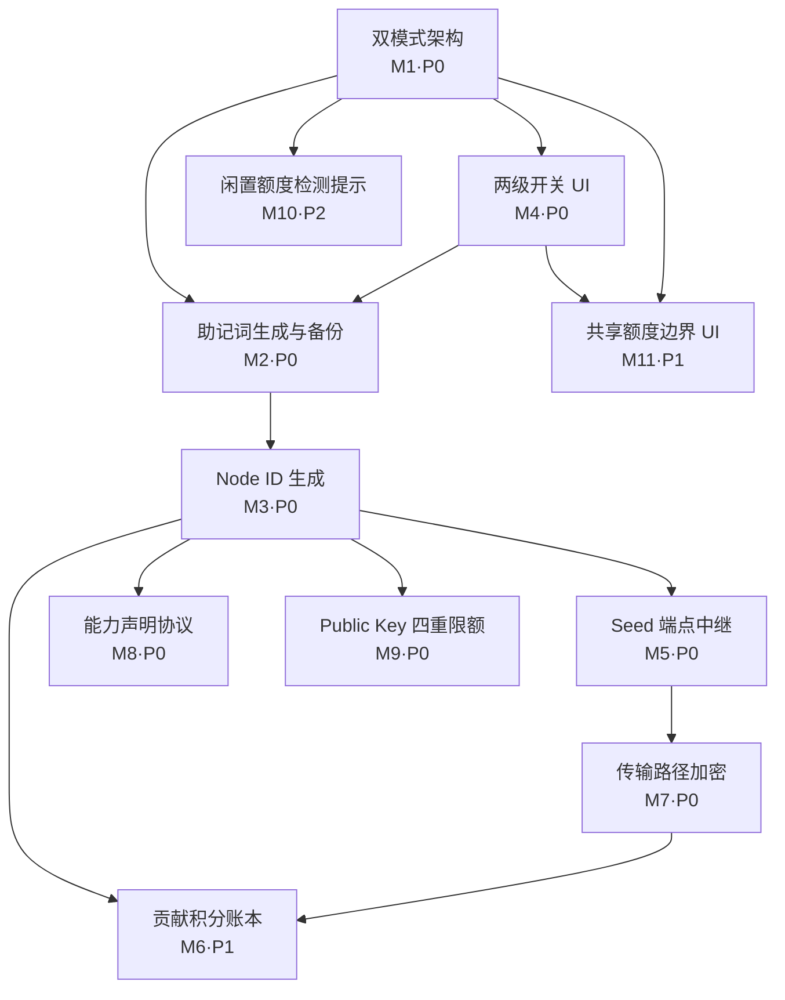

# OpenModelPool Phase 1（共享版最小闭环）产品需求文档（PRD）

> **文档版本**: PRD-Phase1 v1.0
> **作者**: 许清楚（产品经理）
> **日期**: 2026-07-18
> **基于**: ROADMAP v4.0、ARCHITECTURE_CN.md、docs/FEDERATION.md、docs/ACCESS_CONTROL.md、现有 admin.html / admin-network.js / admin-provider.html
> **语言**: 简体中文

---

## 0. 文档约定

- **优先级**：`P0`=必须（缺一则最小闭环不成立）、`P1`=应当（闭环成立但经济/体验不完整）、`P2`=可以（增长/体验增强）。
- **模式术语**：`个人版（Personal Mode）`= 默认、仅本地；`共享版（Network Mode）`= 用户主动加入后启用身份、账本、中继、Public/Guest Key 等。
- **两级开关**：`network_enabled`（是否入网，默认 false）、`share_to_pool`（是否共享剩余额度，默认 false）；`share_to_pool` 单向依赖 `network_enabled`（可只入网不共享，不可只共享不入网）。
- **身份链**：BIP39 助记词 → Ed25519 私钥（仅本机）→ 公钥（广播）→ `Node ID = mm- + Base58(公钥前 16 字节)`。
- 本文档**只做需求与设计，不含任何实现代码**。

---

## 1. 产品目标

**一句话愿景**：让你的闲置 AI 额度，变成一张全球可用的公益通行证——零发币、零上传密钥、可随时退出。

**Phase 1 目标（最小闭环）**：在 Phase 0 个人版 MVP（34+ 提供商、本地额度管理、密钥体系 v4）之上，引入**双模式架构 + 助记词身份 + 单跳中继 + 传输路径加密 + 贡献积分账本 + Public Global Key 四重限额**，打通"请求节点 → Seed 中继 → 资源节点"的可运行闭环，**绝不破坏个人版**。

**用户价值**：
- 个人版用户：本地代理体验完全不受影响，永不被强制升级。
- 共享贡献者：把闲置额度安全共享出去，获得绑定身份的、不可提现/交易的贡献积分与网络访问权。
- 共享消费者：用 Public / Guest Key 极低门槛访问全网共享算力。

**成功指标（建议）**：入网零配置门槛、个人版零回归、跨节点请求成功率 ≥ 95%、Public Key 滥用事件 = 0（四重限额生效）。

---

## 2. 用户故事（覆盖 11 个里程碑）

> 格式：作为…我希望…以便…

- **US-1（个人版 / M1、M4）**：作为个人版用户，我希望默认永远运行在个人模式且不被强制升级，以便我的本地代理体验完全不受影响。
- **US-2（个人版 / M10）**：作为已配置 Provider Token 且开启额度管理的用户，当本月还有剩余额度时，我希望收到温和的"加入共享网络"提示，以便我知晓可以贡献闲置额度。
- **US-3（共享贡献者 / M2、M3、M4）**：作为想贡献的用户，我希望点击"加入共享网络"后按引导生成助记词、强制备份并派生 Node ID，以便我拥有不可伪造的网络身份。
- **US-4（共享贡献者 / M11）**：作为贡献者，我希望配置"共享额度边界"（每日贡献上限、仅共享空闲额度、模型白名单），以便我不会过度共享影响自用。
- **US-5（共享贡献者 / M5、M7、M6）**：作为资源节点，我希望我的节点通过 Seed 中继把请求转发给其他节点且传输路径加密（中继不可见），并按 request-id 累计贡献积分，以便我安全、可计量地贡献。
- **US-6（共享贡献者 / M8）**：作为资源节点，我希望向网络签名声明我提供的能力（模型/Provider），以便请求节点能发现并路由到我。
- **US-7（共享消费者 / M8）**：作为消费者节点，我希望发现网络上其他节点声明的能力，以便我能路由到合适的资源节点。
- **US-8（共享消费者 / M5、M7）**：作为消费者，我希望我的请求经由 Seed 中继到达资源节点且途中加密，以便我的调用私密且能跨节点使用。
- **US-9（共享消费者 / M9）**：作为 Public / Guest Key 持有者，我希望访问共享池时受到四重限额保护，以便公共入口不被滥用且池子可持续。
- **US-10（网络参与者 / M6）**：作为网络参与者，我希望我的贡献积分（不可提现/交易、绑定 Node ID）被准确记录，以便我获得应有的网络权利。
- **US-11（任意用户 / M1）**：作为任意用户，我希望随时退出共享网络回到个人版且本地功能不受影响，以便我没有被锁定的顾虑。

---

## 3. 需求池（分 P0 / P1 / P2）

> 11 个里程碑拆分为 13 条需求。里程碑级优先级分布：**8 × P0 / 2 × P1 / 1 × P2**（M1、M2、M3、M4、M5、M7、M8、M9 = P0；M6、M11 = P1；M10 = P2）。

### P0 — 闭环必需（缺一则最小闭环不成立）

#### REQ-1（M1）双模式运行时底座
- **描述**：后端引入 `network_enabled` 配置（默认 `false`）。个人版为默认且唯一默认启动模式；开启后节点进入 Network Mode，启用 Node ID、贡献账本、能力声明、Public/Guest Key、共享额度等附加能力。所有网络能力须在 `network_enabled=true` 时才初始化。
- **所属模块**：模式与配置
- **依赖项**：无
- **验收标准**：
  1. 全新安装默认 `network_enabled=false`，`/v1` 接口与 Phase 0 行为完全一致（无回归）；
  2. 关闭时除既有本地功能外不存在多余网络出站连接；
  3. 配置持久化，重启后保持。

#### REQ-2（M1）收敛 `federation_enabled` → `network_enabled`
- **描述**：现有代码存在 `federation_enabled` 与 `network_enabled` 双字段（见 `admin-network.js` 的 `renderNetworkUI` / `confirmNetworkJoin` 中隐式同步两字段）。Phase 1 收敛为单一 `network_enabled` 真值来源，移除对 `federation_enabled` 的隐式同步，避免状态漂移。
- **所属模块**：模式与配置
- **依赖项**：REQ-1
- **验收标准**：
  1. 全代码库仅保留 `network_enabled` 一个真值来源；
  2. 升级迁移：旧 `federation_enabled=true` 的节点自动映射为 `network_enabled=true`；
  3. 管理面板不再出现双开关语义冲突。

#### REQ-3（M4）两级开关 UI（`network_enabled` + `share_to_pool`）
- **描述**：在 `admin.html` 的"共享网络"卡片（`federationCard`，约 line 642）中，将现有单个 `sharedNetworkToggle` 替换为两个独立开关：`network_enabled`（是否入网，默认 false）、`share_to_pool`（是否共享剩余额度，默认 false）。约束：`share_to_pool` 仅在 `network_enabled=true` 时可开启；关闭 `network_enabled` 时自动关闭 `share_to_pool`（单向依赖）。
- **所属模块**：模式与配置 / UX
- **依赖项**：REQ-1
- **验收标准**：
  1. 默认两者均为 false；
  2. 未入网时 `share_to_pool` 开关置灰不可点；
  3. 关闭 `network_enabled` 后 `share_to_pool` 自动归 false 并禁用；
  4. 状态实时保存到后端并刷新 UI。

#### REQ-4（M4）入网前置校验
- **描述**：用户尝试开启 `network_enabled` 时，前端校验触发条件（已配置 ≥1 个 Provider Token **且** 该 Token 已开启额度管理 **且** 本月 `remaining_quota > 0`）。不满足时引导去配置而非直接报错阻塞。
- **所属模块**：模式与配置 / UX
- **依赖项**：REQ-3
- **验收标准**：
  1. 缺任一条件时开关无法开启，并给出明确指引（"请先配置 Provider Token / 开启额度管理 / 本月仍有剩余额度"）；
  2. 满足时正常进入入网引导（REQ-5）。

#### REQ-5（M2）助记词生成与备份流程
- **描述**：入网引导中生成 BIP39 助记词（12 或 24 词，用户可选）。流程：项目说明（公益共享、绝不发币、Key 不上传）→ 用户确认理解 → 生成助记词 → **强制备份**（抄写确认 / 加密导出）→ 才进入下一步。助记词仅本地生成与存储，永不上传。
- **所属模块**：身份
- **依赖项**：REQ-3、REQ-4
- **验收标准**：
  1. 仅本地生成，网络抓包无助记词外传；
  2. 必须完成备份确认（勾选"我已抄写"或导出）才能继续；
  3. 12/24 词可切换且校验 BIP39 checksum；
  4. 提供加密导出（密码保护）选项。

#### REQ-6（M3）Node ID 生成（BIP39 → Ed25519 → hash）
- **描述**：由助记词派生 Ed25519 私钥（私钥仅本机）；公钥广播；`Node ID = mm- + Base58(公钥前 16 字节)`（沿用 FEDERATION 既有格式）。所有广播数据（能力声明、贡献、评分）用私钥签名。
- **所属模块**：身份
- **依赖项**：REQ-5
- **验收标准**：
  1. 同一助记词派生同一 Node ID（确定性）；
  2. Node ID 格式匹配 `mm-[base58]`；
  3. 私钥不离开本机（审计/抓包验证）；
  4. 公钥可验证签名。

#### REQ-7（M5）Seed 端点中继服务
- **描述**：实现单跳中继：请求节点 → Seed 端点（中继）→ 资源节点。Seed 维护已知节点注册表与在线状态，负责把请求转发到拥有目标能力的资源节点。Seed 列表可配置（Phase 1 默认官方 `seed1`，支持自托管）。
- **所属模块**：中继与传输
- **依赖项**：REQ-6（需身份签名）
- **验收标准**：
  1. `seed1` 在线时，入网节点能完成一次跨节点请求；
  2. Seed 不持有任何 Provider Key / 助记词（仅路由元数据）；
  3. Seed 列表可配置（配置文件 + 运行时可改）；
  4. Seed 故障时**不污染个人版**请求路径（个人版完全不经 Seed）。

#### REQ-8（M7）传输路径加密（中继不可见）
- **描述**：请求节点与资源节点之间建立加密通道，Seed 中继仅转发密文，无法解密请求/响应内容。资源节点需解密以调用上游 Provider。
- **所属模块**：中继与传输
- **依赖项**：REQ-6（基于身份密钥协商）、REQ-7
- **验收标准**：
  1. 在 Seed 节点抓包仅见密文，无明文 Prompt / 响应；
  2. 资源节点可正常解密并回填响应；
  3. 密钥协商失败时有明确降级/报错，绝不明文泄露。

#### REQ-9（M8）能力声明协议（CapabilityClaim）
- **描述**：资源节点向 Seed / 网络签名发布 `CapabilityClaim`（节点 ID、模型列表、Provider、版本、时间戳），请求节点据此发现与路由。Phase 1 **不做 probe 验证**（留待 Phase 2），仅做声明 + 签名 + 基础字段校验。
- **所属模块**：能力发现
- **依赖项**：REQ-6
- **验收标准**：
  1. 入网节点发布的能力声明含 Node ID 与签名且可被校验；
  2. 请求节点能列出全网可见能力并据以选择资源节点；
  3. 声明字段缺省/非法时不污染路由表。

#### REQ-10（M9）Public Global Key 四重限额
- **描述**：对 `Public Key`（全局公共入口，现状格式 `sk-openmodelpool-com-github-lisiyu-openmodelpool-public-key-v1`）施加四重限额，防止共享池被滥用。四维建议：① 每节点/每身份每日请求数上限；② 每 IP RPM（每分钟请求数）；③ 单请求最大 Token 上限；④ 模型/Provider 可访问白名单（按 Tier 或显式列表）。限额维度与默认值见 §7 Q4。
- **所属模块**：公共入口与限额
- **依赖项**：REQ-1、REQ-9（能力声明用于白名单裁剪）
- **验收标准**：
  1. 任一维度超限即拒绝并明确提示；
  2. 四维同时生效；
  3. 限额配置可由管理员调整并持久化；
  4. Guest Key（Consumer / Collaborator）不受 Public Key 四维限制（走各自 Key 的访问策略，见 ACCESS_CONTROL）。

### P1 — 价值增强（闭环成立但经济/体验不完整）

#### REQ-11（M6）贡献积分账本（Contribution Credit）
- **描述**：记录本节点作为资源被调用（`share_to_pool` 开启且请求带 `request-id`）时获得的贡献积分；消费（调用他人 Provider）时扣减。积分**不可提现/交易、绑定 Node ID、每日上限**。Phase 1 采用**本节点账本 + Seed 聚合视图**（非全量 P2P 账本同步，BFT 留待后续）。
- **所属模块**：账本与积分
- **依赖项**：REQ-6、REQ-7、REQ-8（基于真实转发事件 + request-id）
- **验收标准**：
  1. 带 `request-id` 的成功转发计入积分，缺失 `request-id` 不计；
  2. 积分随 Node ID 绑定，退出再入网可恢复（基于助记词派生同一 ID）；
  3. 每日积分有上限；
  4. 管理面板展示"我的贡献"与积分余额（`admin.html` 已有 `netCredits` 槽位可复用）。

#### REQ-12（M11）共享额度边界配置 UI
- **描述**：在入网引导末尾与"共享网络"卡片内提供"共享额度边界"表单：每日贡献上限（Token 或请求数）、"仅共享空闲额度"开关（仅贡献本月未自用部分）、模型/Provider 白名单。落点：复用现有 `quotaAllocation` 区块（约 line 677）并扩展。
- **所属模块**：模式与配置 / UX
- **依赖项**：REQ-3、Phase 0 额度管理
- **验收标准**：
  1. 可设置每日贡献上限并被后端强制执行；
  2. "仅共享空闲额度"开启时，自用优先、剩余才入池；
  3. 白名单外模型不进入共享池；
  4. 配置持久化并在额度消耗优先级中生效（参考 ACCESS_CONTROL §4.2）。

### P2 — 增长/体验增强

#### REQ-13（M10）闲置额度检测与加入提示
- **描述**：当节点满足触发条件（有 Provider Token + 额度管理开启 + 本月 `remaining_quota>0`）且仍处个人模式时，在管理面板以温和 toast/横幅提示"你本月还有 X 额度闲置，是否加入共享网络？"。落点：复用现有 `toast()` 函数 + 顶部 `section-note` 区（`admin.html` line 347）。
- **所属模块**：UX / 提示
- **依赖项**：REQ-1、Phase 0 额度统计
- **验收标准**：
  1. 满足条件且未入网时仅在管理面板内出现一次/低频提示，不打扰外用请求；
  2. 点击"了解/加入"跳转入网引导；
  3. 用户 dismiss 后不再重复骚扰（本地记忆）；
  4. 不满足时绝不出现。

---

## 4. 里程碑依赖图（Mermaid）



**依赖要点**：
- **地基**：`M1 双模式` 与 `M4 两级开关` 是整张图的根，所有能力都挂在 `network_enabled=true` 之后。
- **身份链**：`M2 助记词` → `M3 Node ID` 是身份地基；`M5 / M7 / M8 / M6 / M9` 全部依赖 `M3`（需要签名身份）。
- **中继链**：`M5 Seed 中继` → `M7 传输加密` → `M6 贡献账本`（加密转发事件才计入积分）。
- **顶层 UX**：`M11 共享边界` 与 `M10 闲置提示` 依赖模式/开关底座，是体验收口层。
- 关键不变量：`share_to_pool` 不可早于 `network_enabled`；`M7` 不可早于 `M5`；`M6` 依赖 `M7`/`M8` 提供真实事件。

---

## 5. 建议的迭代切片（5 个可独立交付增量）

| 切片 | 范围（里程碑） | 退出标准（Definition of Done） |
|------|---------------|-------------------------------|
| **① 模式与两级开关底座** | M1、M4（REQ-1~4、REQ-12 的部分底座） | 节点可在管理面板切换两级开关；默认个人版；现有功能/接口**零回归**；不满足触发条件无法入网；`federation_enabled` 已收敛。 |
| **② 身份：助记词 + Node ID** | M2、M3（REQ-5、REQ-6） | 入网引导产出**确定性** Node ID；私钥不离开本机；助记词**不可绕过备份**；公钥签名可被校验。 |
| **③ 贡献账本 + Public Key 四重限额** | M6、M9（REQ-10、REQ-11） | 成功转发带 `request-id` 的请求计入积分；四维限额任一超限即拒绝；限额可配置持久化；管理面板展示积分。 |
| **④ 单跳中继 + 传输加密 + 能力声明** | M5、M7、M8（REQ-7、REQ-8、REQ-9） | 跨节点请求经 Seed 完成；Seed 抓包无明文；能力声明签名可校验且可被请求节点发现路由；Seed 故障不影响个人版。 |
| **⑤ 共享 UX：共享额度边界 + 闲置检测** | M11、M10（REQ-12、REQ-13） | 可设边界并被强制执行；"仅共享空闲额度"与白名单生效；满足条件且未入网时温和提示一次，dismiss 后不骚扰。 |

> 推荐顺序：① → ② → ③/④（可并行，③ 与 ④ 无强依赖可同迭代）→ ⑤。切片 ③ 与 ④ 可并行，因 ③ 仅依赖身份（②），④ 亦仅依赖身份（②）。

---

## 6. UI 设计稿

> 落点说明：所有新增 UI 均基于现有 `admin.html` 的 `federationCard`（约 line 642）与 `networkDisclaimerModal`（约 line 826），尽量复用既有样式（`.card`、`.section-note`、toggle slider、`toast()`）。

### 6.1 "加入共享网络"引导（多步向导 / 复用 disclaimer modal 升级）

落点：将现有 `networkDisclaimerModal` 升级为 4 步向导（说明 → 助记词备份 → 边界配置 → 完成）。

```
┌─────────────────────────────────────────────┐
│ 🌐 加入共享网络                       [✕]     │
├─────────────────────────────────────────────┤
│ 步骤:  (1 须知) → (2 备份) → (3 边界) → (4 完成)│
│                                               │
│ [须知]                                         │
│  • 公益共享 · 绝不发币 · Key 不上传             │
│  • 你的 Provider 将贡献到全网资源池             │
│  • 你将获得访问其他节点 Provider 的权限         │
│  • 贡献积分不可提现/交易，绑定 Node ID          │
│  ☐ 我已阅读并理解以上说明，自愿承担相关风险     │
│                                               │
│              [取消]   [下一步 →]               │
└─────────────────────────────────────────────┘
```

### 6.2 助记词备份页（向导第 2 步）

```
┌─────────────────────────────────────────────┐
│ (2/4) 备份你的助记词（身份恢复唯一凭证）        │
│                                               │
│  🔐 请抄写下方助记词并妥善保存：              │
│  ┌───────────────────────────────────────┐  │
│  │ 1.correct  2.horse  3.battery ... 12.z │  │
│  │ 13.alpha   ... 24.omega  (24 词可选)   │  │
│  └───────────────────────────────────────┘  │
│  [🔄 切换 12/24 词]   [📥 加密导出(.json)]   │
│                                               │
│  ☐ 我已抄写并保管好助记词（不可取消勾选）      │
│                                               │
│         [← 上一步]   [下一步 →]               │
└─────────────────────────────────────────────┘
```
> 强制：未勾选"已抄写"则"下一步"禁用（沿用现有 `toggleNetworkConsentBtn` 模式）。

### 6.3 两级开关设置项（federationCard 内替换原单开关）

落点：`admin.html` line 645-656 区域，用两个 toggle 替换 `sharedNetworkToggle`。

```
┌─────────────────────────────────────────────┐
│ 🌐 共享网络         [✅ 已加入 / 未加入]        │
│ ─────────────────────────────────────────── │
│ [🌐 加入共享网络 ............ (●─────) OFF]    │  network_enabled
│   开启后获得入网身份与全网资源访问权           │
│                                               │
│ [🔗 共享剩余额度 .......... (●─────) DISABLED] │  share_to_pool（未入网时置灰）
│   把剩余额度贡献到共享池（需先加入网络）       │
│ ─────────────────────────────────────────── │
│ [🔀 开启中继 Relay ......... (●─────) OFF]    │  （现有 relay 开关保留，见 §7 Q8）
└─────────────────────────────────────────────┘
```

### 6.4 共享额度边界配置（向导第 3 步 + 卡片内 quotaAllocation 扩展）

落点：复用 `quotaAllocation` 区块（line 677）扩展为边界配置。

```
┌─────────────────────────────────────────────┐
│ (3/4) 配置共享额度边界                         │
│                                               │
│ 每日贡献上限:  [ 20000 ] Token  ▾             │
│   （0 = 不限制；建议默认 = 节点总配额 20%）    │
│                                               │
│ [✓] 仅共享空闲额度                            │
│     自用优先，仅贡献本月未自用部分             │
│                                               │
│ 模型/Provider 白名单:                         │
│   (●) 全部模型   ( ) 仅白名单                  │
│   [ + 添加模型/Provider ]                     │
│   （白名单外模型不进入共享池）                │
│                                               │
│         [← 上一步]   [完成加入 →]             │
└─────────────────────────────────────────────┘
```

### 6.5 闲置额度加入提示（toast / 顶部横幅）

落点：复用 `toast()` + 顶部 `section-note`（`admin.html` line 347）。

```
┌─────────────────────────────────────────────┐
│ 💡 你本月还有约 18,400 Token 闲置额度。       │
│   加入共享网络，既能帮到他人，也能获得访问    │
│   全网算力的权限。 [了解并加入]  [暂不]       │
└─────────────────────────────────────────────┘
   ↑ 仅在满足条件且未入网时出现；dismiss 后不再提示
```

---

## 7. 待确认问题（含建议默认值）

> 凡路线图信息不足以判定者，以下给出**建议默认值**（供决策），标注为"假设"。

### Q1. Seed 端点由谁运营？
- **现状**：路线图仅写"Seed 端点连接"，未定运营方。
- **建议默认值**：Phase 1 由官方公益运营 1 个公共 `seed1`（开源可自托管）；配置文件与运行时均支持自定义 Seed 列表（多 Seed 留待 Phase 2）。Seed 仅持路由元数据，不持密钥。
- **需决策**：是否允许第三方公开 Seed？审计/合规责任归属？

### Q2. 中继计费的积分换算规则？
- **现状**：FEDERATION 仅说"提供 Provider 被调用时获得贡献积分"，未给公式。
- **建议默认值**：
  - 赚取：`贡献积分 += round(成功转发消耗的 Token 数 / 1000)`（即每 1K token ≈ 1 分）；
  - 消费：调用他人 Provider 等额扣减；
  - 每日上限：`1000` 分/天（由网络参数控制，见 FEDERATION §4.5）；
  - 无效：缺失 `request-id`、转发失败不计。
- **需决策**：是否叠加延迟/成功率加权？Phase 1 先用线性模型，声誉加权留 Phase 3。

### Q3. 助记词丢失的找回策略？
- **现状**：FEDERATION 明确"丢失助记词 = 丢失 Node ID 身份和贡献积分"。
- **建议默认值（设计取舍）**：Phase 1 **不提供找回**——身份即助记词，丢失即新身份、积分清零；UI 强提示风险，并提供**加密导出**（密码保护）作为唯一备份手段。
- **需决策**：是否允许"绑定 GitHub 作为弱找回"（争议大，建议 Phase 1 不做）。

### Q4. Public Global Key 四重限额具体维度与默认值？
- **现状**：路线图写"四重限额"但未定义维度。
- **建议默认四维**：
  1. **每日请求数上限**：每节点/每身份 `2000` 次/天；
  2. **速率限制 RPM**：每 IP `60` 次/分钟；
  3. **单请求 Token 上限**：`8000` token/请求；
  4. **模型/Provider 白名单**：默认放开全部共享模型，管理员可缩窄为 Tier 列表。
- **需决策**：四维的默认值是否需要按节点规模动态？是否对 Guest Key 也叠加？（建议 Guest Key 走 ACCESS_CONTROL 既有策略，不叠加 Public 四维。）

### Q5. 能力声明（CapabilityClaim）的验证粒度？
- **建议默认值**：Phase 1 **不做 probe 验证**，仅声明+签名+基础字段校验；虚假能力防御与探测请求留 Phase 2（配合声誉系统）。
- **需决策**：若 Phase 1 即出现明显谎报，是否需要最小惩罚（如首次失败标记）？

### Q6. 共享额度边界的默认值？
- **建议默认值**：默认"仅共享空闲额度 = 开启"、每日贡献上限 = 节点总配额的 `20%`（或显式 `20000` token）、模型白名单 = 全部。即**默认保守**，避免用户无感过度共享。
- **需决策**："仅共享空闲额度"默认开启是否影响消费者体验（池子偏小）？是否提供"激进共享"档？

### Q7. 现有 `relay` 开关与两级开关的关系？
- **现状**：`admin.html` 已有独立 `relayToggle`（"可只做中继而不加入共享网络"），与 `network_enabled`/`share_to_pool` 语义并存。
- **建议默认值**：`relay`（传输层转发能力）可作为**独立于 `share_to_pool`** 的能力存在；但**中继转发他人请求本身算贡献**（计入积分），因此中继开启建议要求 `network_enabled=true`（至少入网）。统一为：`network_enabled` 为前提，`share_to_pool` 决定"是否把自有额度入池"，`relay` 决定"是否帮忙转发他人请求"。
- **需决策**：是否保留 `relay` 作为第三个独立开关，还是并入 `network_enabled`？建议保留但要求 `network_enabled=true`。

### Q8. Phase 0 既有 `quotaAllocation`（Guest%/Public% 滑块）与新增"边界配置"如何共存？
- **建议默认值**：保留 Guest%/Public% 的**池内分配比例**语义；新增"每日贡献上限 / 仅共享空闲 / 白名单"作为**入池边界**语义，二者正交（先定边界→再定池内比例）。
- **需决策**：UI 是否需要合并为单页？建议向导内合并展示。

---

## 8. 非目标（Out of Scope / Phase 1 不做）

明确以下**不在 Phase 1 范围**，避免范围蔓延（均属 Phase 2/3 或已定原则）：

- **不发币、不提现、不交易**：贡献积分永久不可兑换法币/金融资产（已定原则）。
- **DHT 节点发现 / Gossip 全量同步**：Phase 1 用 Seed 中心注册表，不做分布式哈希表与 Gossip。
- **多跳路由**：仅单跳（请求→Seed→资源），多跳留 Phase 2。
- **声誉系统（S/A/B/C/D 自动评分与降级）**：Phase 1 不做节点声誉评级与自动移除。
- **公证人去中心化 / 多公证人冗余**：Phase 1 为单 `seed1`，多公证人留 Phase 3。
- **联邦治理 / 投票 / 网络参数集体决策**：Phase 1 参数由官方/管理员配置。
- **防共谋增强 / 女巫攻击防御（除助记词身份绑定外的部分）**：仅用助记词身份做基础绑定。
- **NAT 穿透（STUN/TURN）、mDNS 局域网发现、反向隧道**：Phase 2。
- **P2P 消息 / 端到端加密聊天**：Phase 1 不含通用 P2P 消息。
- **跨节点账本全量同步与 BFT 共识**：Phase 1 仅"本节点账本 + Seed 聚合视图"，全量同步留 Phase 3。
- **能力验证 probe / 虚假能力防御机制**：留 Phase 2。
- **多 Seed 冗余与故障切换**：留 Phase 2/3。
- **模型能力矩阵之外的定价/计费货币化**：不做。

---

## 附录 A：与现有资产的对齐清单

| 现有资产 | Phase 1 复用/改造点 |
|---------|-------------------|
| `admin.html` `federationCard` (L642) | 两级开关替换单开关；扩展 `quotaAllocation` 为边界配置 |
| `admin.html` `networkDisclaimerModal` (L826) | 升级为 4 步入网向导 |
| `admin-network.js` `confirmNetworkJoin` | 注入助记词生成→备份→Node ID→边界配置流程 |
| `admin-network.js` `renderNetworkUI` | 收敛 `federation_enabled`/`network_enabled` 双字段为单源 |
| `admin.html` `netCredits` 槽位 (L705) | 展示贡献积分账本（REQ-11） |
| `toast()` + 顶部 `section-note` (L347) | 闲置额度提示（REQ-13） |
| `ACCESS_CONTROL.md` §4.2 额度池与优先级 | 共享边界配置的执行依据 |
| `FEDERATION.md` §4.1 身份格式 `mm-+Base58(前16字节)` | Node ID 格式沿用 |
| 密钥体系 v4（`ompk_`/`omgk_`/`global`/`provider`） | 个人版密钥保持不变，新增助记词身份层 |

---

*文档结束 · PRD-Phase1 v1.0 · 许清楚*
